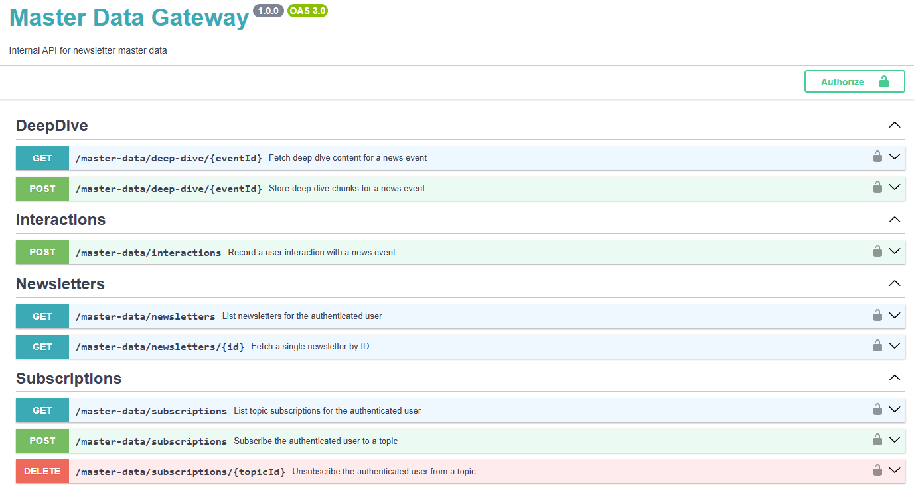

# myfeed

This is my journey to learn highly scalable software design and development — PHP, Symfony, Laravel, AWS, and who knows what else.

**What is myfeed?** A newsletter engine that aggregates news about the topics you care about (e.g. "AI", "Global Markets", "Legal regulations"). You subscribe to topics, myfeed discovers the daily news, integrates background from past events, and delivers a personalised digest.

**Phase 1 (current):** API / Serving Layer with mocked data — no real service implemented, load-tested to 1,000 req/s before any real pipeline is wired in.

**Main goal:** Get hands-on with systems that handle serious traffic — AWS, PHP, Symfony, Doctrine, Laravel. Real implementation is postponed.

---

## Architecture

```
Client
  │ HTTPS + Bearer <cognito_jwt>
  ▼
ALB (eu-west-1, internet-facing)
  │ HTTP/1.1 → target group port 8000
  ▼
ECS Fargate — newsletter  (FastAPI + uvicorn · 1 vCPU / 2 GB per task · min 0, max 2)
  │  GET /newsletters, GET /newsletters/{id}
  │  GET / POST / DELETE /subscriptions
  │  POST /interactions
  │  POST /deep-dive/{event_id}   [SSE streaming]
  │
  │ internal HTTP  (VPC-only · private subnet · no public route)
  ▼
ECS Fargate — mdg  (PHP 8.4 / Symfony 7 · nginx + PHP-FPM via supervisord · 1 vCPU / 2 GB per task)
  │  GET  /master-data/newsletters/{id}
  │  GET  /master-data/subscriptions
  │  POST /master-data/interactions
  │
  └── RDS PostgreSQL db.t3.micro       schema owned by Doctrine ORM

          ┌─ local only ──────────────────────────────────────────────┐
          │  Redis (Docker Compose)   master data cache · TTL 1h      │
          │  ElastiCache was removed from AWS dev (cost: ~$3/day idle) │
          └───────────────────────────────────────────────────────────┘
```

Compute infrastructure managed with Terraform (`terraform/`). Legacy SAM template kept in `infra/template.yaml` for reference.

---

### MDG API — Swagger UI

MDG exposes an interactive API explorer at `http://localhost:9000/api/doc`, generated by [NelmioApiDocBundle](docs/php-learning-path/05-nelmio-api-doc-bundle.md) from PHP attributes on each controller. The spec is code-first — no separate build step, always in sync with the real routes.

8 endpoints across 4 groups:

| Group | Endpoints |
|---|---|
| **DeepDive** | `GET /master-data/deep-dive/{eventId}`, `POST /master-data/deep-dive/{eventId}` |
| **Interactions** | `POST /master-data/interactions` |
| **Newsletters** | `GET /master-data/newsletters`, `GET /master-data/newsletters/{id}` |
| **Subscriptions** | `GET /master-data/subscriptions`, `POST /master-data/subscriptions`, `DELETE /master-data/subscriptions/{topicId}` |



How-to: [docs/how-to/swagger-ui-nelmio.md](docs/how-to/swagger-ui-nelmio.md)

---

### Why not Lambda

Lambda was the original compute layer and was replaced for two reasons.

**1. Burst throttling makes load-test results meaningless.**
Lambda scales by spinning up one container per concurrent request. Inside a VPC, each new container must attach an ENI before it can reach Redis or Aurora — a 2–5 second overhead. Under a burst of 30 VUs, this produced 2363 throttles in the first 60 seconds before containers warmed up. Steady-state (warm containers) showed zero throttles, meaning the numbers from the load tests depended entirely on whether Lambda happened to be warm — not on the API's real performance. Fargate tasks stay running with ENIs permanently attached, so every request — first or millionth — measures actual handler latency.

**2. Lambda is 10× more expensive at the target scale.**
The didactic scenario is 1 million users generating peaks of 1,000 req/s. At that throughput:

| | Lambda | Fargate (4 tasks) |
|---|---|---|
| Monthly cost | ~$1,922 | ~$185 |
| Cost ratio | 10.4× more expensive | — |

Lambda's per-invocation pricing compounds at scale: each request pays for container spin-up, GB-s of memory, and request fees. Fargate charges for reserved vCPU/memory regardless of request count, so the unit cost collapses as throughput rises. The break-even is ~44 req/s sustained — anything above that, Fargate wins on cost.

Full analysis: [`docs/decisions/002_lambda-vs-fargate.md`](docs/decisions/002_lambda-vs-fargate.md)

---

### Why Redis access moved from newsletter to MDG

Originally FastAPI owned Redis directly: on every request it checked the cache, fell through to Aurora on a miss, and wrote the result back. This worked while FastAPI was the only service writing data.

When MDG was introduced as the authoritative data layer (owning Aurora via Doctrine), a cache invalidation problem appeared: whenever MDG wrote or updated a record, FastAPI's Redis entries became stale. The only way to fix that without moving cache ownership was to have MDG notify FastAPI which keys to drop — but that callback creates a circular dependency (FastAPI → MDG → FastAPI). Every new write path in MDG would have had to remember the invalidation call; a missed call leaves stale data silently.

The fix is to move cache ownership to the writer. MDG now handles all Redis read / write / invalidation internally. FastAPI makes a plain HTTP call to MDG and gets back fresh data — whether that came from Redis or Aurora is MDG's concern, not FastAPI's. Invalidation becomes a local function call inside MDG rather than a distributed coordination protocol across two services.

The performance cost is bounded: a cache hit now travels FastAPI → MDG → Redis instead of FastAPI → Redis, adding ~0.5–2 ms intra-VPC. For the p99 < 50 ms load test target that overhead is negligible.

Full analysis: [`docs/decisions/006-mdg-owns-redis-cache.md`](docs/decisions/006-mdg-owns-redis-cache.md)

---

### Cache adapter per environment

ElastiCache Serverless cannot be stopped — only deleted. At ~$3/day with negligible dev traffic, it was eliminated from AWS (`dev` environment). Redis remains available locally via Docker Compose.

MDG's cache layer is built around a `RedisClientInterface`. Two concrete implementations exist:

| Implementation | Behaviour | Used in |
|---|---|---|
| `PredisAdapter` | Connects to Redis; reads/writes normally | `local` (Docker Redis present) |
| `NullCacheAdapter` | Returns `null` on every read; discards writes | `dev` (no Redis in AWS) |

Symfony's environment-specific DI wires the right adapter at container compile time — no `if/else` in application code:

```
config/
  services.yaml              # global: RedisClientInterface → PredisAdapter  (local uses this)
  packages/dev/
    services.yaml            # override: RedisClientInterface → NullCacheAdapter
```

In `dev`, every MDG request falls through to Aurora. Acceptable because dev traffic is negligible. To restore caching in AWS, add ElastiCache back and delete `config/packages/dev/services.yaml` — no other code change needed.

Full analysis: [`docs/decisions/009-redis-removal-null-cache-adapter.md`](docs/decisions/009-redis-removal-null-cache-adapter.md)

---

### Lessons Learned

**RDS/Redis are VPC-private — a bastion is required for local access.**
Both RDS and ElastiCache live in private subnets with no public route. An EC2 bastion in the public subnet bridges local machines into the VPC via SSM port-forwarding. AL2023 AMI ships without SSM agent — install it explicitly via `dnf install amazon-ssm-agent` in Terraform `user_data`. No SSH keys, no open port 22.

**Per-row inserts over a tunnel are catastrophically slow.**
Seed script ran 800 s over the SSM tunnel using per-row `INSERT` loops — each row pays the full round-trip latency. `execute_values` batches all rows into one query: 800 s → 17 s (47× faster). Rule: always bulk-insert over any high-latency connection.

**Lambda cold starts under burst make load-test numbers unreliable.**
Lambda inside a VPC must attach an ENI per new container — 2–5 s overhead. At 1,000 req/s, 2,363 throttles appeared in the first 60 s. A k6 ramp-up warmup stage didn't help because the bottleneck is ENI provisioning, not the handler. Fargate tasks stay permanently warm; every request — first or millionth — measures real handler latency.

**k6 alone can't separate cached from uncached latency.**
Without observability hooks, all requests collapse into a single latency distribution. Two custom response headers solve it: `X-Cache: HIT|MISS` (read as a k6 tag to split metrics by cache source) and `X-Bypass-Cache` (forces a cold Aurora path on demand without flushing Redis). Cache coverage and per-source p99 become directly measurable.

---

### My Progresses

| Area | Technologies | Starting Level | Current Level |
|---|---|---|---|
| Backend framework | PHP, Symfony, Laravel | 2/10 | 5.5/10 |
| Infrastructure | AWS (Fargate, Lambda, EC2, RDS, VPC) | 3/10 | 6/10 |
| Scalability | RDS Proxy, ElastiCache, load testing with k6 | 3/10 | 6/10 |
| Complex Data | DynamoDB, Neo4j/Neptune, pgvector | 3/10 | 3/10 |
| DevOps | Docker, GitHub Actions, CI/CD, Terraform | 6/10 | 6.5/10 |
| Claude Code | Claude Code | 2/10 | 5.5/10 |

---

## Load Tests

### Last Update: 2024-06-20 - Newsletter Fargate + Redis cache (MDG missing)
k6 was run from an EC2 instance in eu-west-1 (same region as the ALB) in order to measure real network latency and avoid bottlenecks from the local machine's connection. The test ramped up to 100 VUs over 60 seconds.

**Baselines** (k6-newsletter-runner EC2, eu-west-1, 100 VUs):

| Metric | Cached (Redis) | Uncached (Aurora bypass) | Ratio |
|---|---|---|---|
| Throughput | 855 req/s | 569 req/s | 1.5× |
| avg latency | 95 ms | 143 ms | 1.5× |
| p(90) | 109 ms | 257 ms | 2.4× |
| p(95) | 136 ms | 331 ms | 2.4× |
| max | 638 ms | 1,290 ms | 2.0× |

---

## Project Layout

```
newsletter/                FastAPI service
  src/
    main.py                FastAPI app, lifespan, router registration
    auth.py                JWT: JWKS fetch (cached), RS256 verify, 401 on failure
    dependencies.py        get_pool(), get_mdg_client(), get_user_id() — Depends providers
    db_async.py            asyncpg pool factory
    cache_async.py         redis.asyncio client factory
    mdg.py                 HTTP client for MDG internal API
    settings.py            Pydantic settings (env vars + YAML config)
    fields.py              StrEnum constants
    response.py            HTTP response builders
    handlers/
      newsletters.py       GET /newsletters, GET /newsletters/{id}
      subscriptions.py     GET / POST / DELETE /subscriptions
      interactions.py      POST /interactions
      deep_dive.py         POST /deep-dive/{event_id}  [SSE streaming]
  tests/
    conftest.py            pytest fixtures (client, mock_pool — FastAPI TestClient)
    test_newsletters.py
    test_subscriptions.py
    test_interactions.py
    test_deep_dive.py
    ...
  scripts/
    pipeline.py            Full load-test pipeline orchestrator
    00_seed.py             Truncate → insert mock data
    01_prewarm.py          Pre-warm Redis cache from seed result
    02_create_test_tokens.py  Issue 100 Cognito Bearer tokens
    03_get_load_test_ids.py   Query live DB for newsletter/event IDs
    run_load_tests.py      k6 runner — reads tokens/IDs, runs scenarios
    flush_redis.py         Flush all Redis keys (cold-start scenarios)
    scale_up.py / scale_down.py  Set ECS desired_count
    config.py / models.py / paths.py / steps.py / tunnel.py / utils.py
  Dockerfile               python:3.12-slim, uvicorn entrypoint
  requirements-fargate.txt fastapi, uvicorn, asyncpg, redis[asyncio], python-jose

mdg/                       PHP 8.4 / Symfony 7 — master data gateway
  src/
    Controller/            NewsletterController, SubscriptionController,
                           InteractionController, DeepDiveController
    Service/               NewsletterService, SubscriptionService,
                           InteractionService, DeepDiveService
    Repository/            Doctrine repositories (one per entity)
    Entity/                Newsletter, Subscription, Interaction, DeepDive
    Cache/                 CacheService, PredisAdapter, RedisClientInterface
    EventListener/         UserContextListener (tenant isolation)
  tests/
    Controller/            PHPUnit controller tests
    Service/               PHPUnit service tests
    Cache/                 PHPUnit cache tests
  config/                  Symfony config (doctrine.yaml, framework.yaml, routes.yaml)
  docker/
    nginx.conf             HTTP → FastCGI proxy, /health, static files
    www.conf               php-fpm pool (pm.max_children=10)
    supervisord.conf       PID 1: starts nginx + php-fpm
  Dockerfile               php:8.4-fpm-alpine + nginx + supervisord

load_tests/
  newsletter/
    config.js              Shared constants (BASE_URL, headers, IDs)
    smoke.js               1 VU · sanity check
    newsletter_cached.js   500 VUs · p99 < 50ms
    newsletter_uncached.js 200 VUs · p99 < 100ms
    deep_dive_sse.js       50 VUs · first chunk < 200ms
    mixed_realistic.js     1,000 VUs · p95 < 150ms
    capacity_benchmark.js  10→200 VUs · observation only
    cold_start_stress.js   spike 0→1000 VUs · errors < 1%
    summary.js             shared k6 summary helpers

migrations/
  001_initial_schema.sql   All CREATE TABLE + INDEX statements
  002_deep_dives.sql

scripts/
  deploy_fargate.sh        Build Docker image, push to ECR, redeploy newsletter ECS
  deploy_mdg_fargate.sh    Build MDG image, push to ECR, redeploy MDG ECS
  deploy_k6_runner.sh      Provision EC2 k6 runner in eu-west-1 via SSM
  deploy.sh                Legacy SAM deploy (kept for reference)

terraform/
  modules/
    fargate/               newsletter ECS Fargate, ALB, ECR, security groups, auto-scaling
    fargate-mdg/           MDG ECS Fargate, ECR, security groups
    bastion/               EC2 bastion for SSM tunnelling to RDS (and Redis before removal in dev env)
    redis/                 ElastiCache Serverless (orphaned — not called from any env; kept for reference)
    aurora/                RDS PostgreSQL (future Aurora Serverless v2)
    vpc/                   VPC, subnets, internet gateway, route tables
  envs/dev/                dev environment root module
  bootstrap/               GitHub OIDC role for CI/CD

config/
  common.yaml              Shared config (DB, Redis, MDG URL, AWS)
  dev.yaml                 dev overrides
  local.yaml               local overrides

infra/
  template.yaml            AWS SAM template (Lambda, kept for reference)

docker-compose.yml         Local PostgreSQL + Redis + MDG
```

---

## Docs

- [Architecture Decisions](docs/decisions/)
- [Troubleshooting Notes](docs/troubleshooting/)
- [Backlog](docs/backlog.md)
- [How-to Guides](docs/how-to/)
