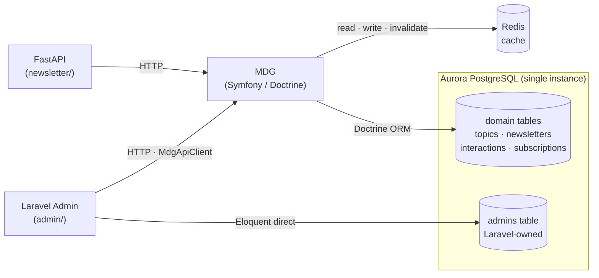

# ADR-011 — Laravel Admin: Dual Data Access Pattern

## Context

Adding a Laravel admin panel that needs two categories of data: its own identity/access infrastructure (admin users, sessions) and newsletter domain data (topics, newsletters, interactions, subscriptions). These have different ownership and access requirements.

## Options Considered

**Option A — Full direct DB access**
Laravel Eloquent reads and writes all tables directly. Simplest setup, full Filament auto-CRUD.
Rejected: violates ADR-004 (MDG is single source of truth for domain schema); two ORMs owning the same tables causes schema drift risk.

**Option B — Full API access via MDG**
Laravel calls MDG HTTP API for everything, including admin user management.
Rejected: over-engineering auth — Breeze sessions and admin credentials are admin-app-internal concerns, not newsletter domain data.

**Option C — Hybrid contextual (chosen)**
Split access by bounded context.

## Decision

**Hybrid Contextual Architecture.**

Laravel accesses Postgres via two distinct flows:

1. **Identity/Access context** — direct Eloquent to `admins` table, managed by Laravel migrations. Auth, sessions, and password hashing are internal to the admin app.

2. **Domain context** — all newsletter domain data (topics, newsletters, news events, threads, subscriptions, interactions) accessed exclusively via `MdgApiClient` → MDG HTTP API. MDG/Doctrine remains the sole writer of domain tables.



## Usage

Laravel `MdgApiClient` (HTTP client wrapper) calls MDG endpoints:
```php
$newsletters = $this->mdg->get('/newsletters');
$this->mdg->post('/interactions', $payload);
```

Admin auth uses native Eloquent:
```php
Auth::attempt(['email' => $email, 'password' => $password]);
```

## Consequences

- ADR-004 preserved: MDG remains single schema owner for domain data.
- Laravel migrations only touch the `admins` table; no risk of conflicting with Doctrine migrations.
- Adding a new domain resource to the admin panel requires an MDG endpoint first, then a Filament resource — two-step flow.
- FastAPI and Laravel admin both consume MDG as an internal API; MDG becomes a true shared service layer.
